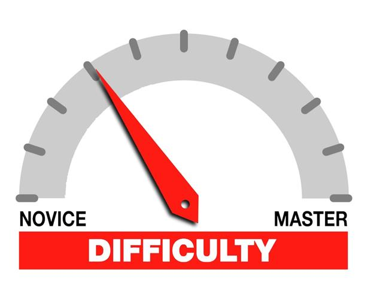

*Difficulty: a thing that is hard to accomplish, deal with, or understand.*

One of my friends asked the question earlier last week -- why is it so hard to be an officer for the student branch? Why is so hard compared to working at my on-campus job? This question came after he struggled a little with bookkeeping for the student organization.

Now I gave him the standard answer - being an officer of an organization requires that you manage your time between school and work. There isn't anyone telling you what to do. It's the answer any good mentor would give, and is mostly true.

But the more I though about it, the more I wondered to myself...damn that's a really great question; it's one that deserves some more thought. Most people I think stop at the answer I gave previously - he obviously isn't managing his time properly.

Here's what I think: the difficult things will always be difficult.

## In the context of programming

### Project: Study Guide (WIP)
## Authors
Michaela Gillan, Khloe Valera, Marie Wong
## Overview
<i>The problem</i>: Every semester students are forced to jump into new topics. They sometimes don’t know exactly what and how to study to optimize their time and efforts, and may not know what they’re signing up for before registering. 
<i>The solution</i>: Study Guide is an application for UHM students to collaboratively create guides for various courses. These guides will be teacher approved and possibly generate extra credit for the submitter.
## Approach
To use Study Guide a student must login and set up their account. Their home page is a hub to be able to browse study guides from previous semesters and sign up as current course takers.
Teachers using Study Guide will also have to login and set up their teacher account. Once verified they will be able to opt-in their course and can approve or reject study guides.
Another section of the site lists all of the courses that have opted-in to Study Guide. Within each course, it is possible to see the accepted study guides and submit study guides for a week or topic. 
There is an online calendar that shows when topics are covered and linked study guides.
Study guides must be substantive–potentially utilizing Bloom’s taxonomy to help students build their understanding of the material.
There are three types of users targeted by Study Guide:
Students that are totally lost in the class and want to look up study guides for direction.

Students that have a good handle on the material and want to submit a study guide for extra credit.
Teachers that want to encourage students to study and collaborate.
Study Guide may have a barrier to adoption due to students being overwhelmed or too lazy to do extra work. Thus the adoption of extra credit points might encourage students and game mechanics could also be implemented to drive engagement. To discourage toxicity submissions will be tied to anonymized usernames.
To ensure accountability accounts will be verified through UH email. There will also be admins who maintain the site and add/remove courses as requested by teachers.
Design goals:
Encourage studying through creation of study guides
Help students study efficiently
Foster community through collaboration and dialogue with teachers
Other applications such as Discord, Piazza, and Lamakū offer online help and resources. Study Guide organically facilitates study guide development for students to access in an organized way and enables future students to get a sneak peek at what the course will cover and its workload.
Mockup page ideas
Some possible mockup pages include:
Landing Page
Login/Register
Student home page
Instructor/TA home page
Course Page 
Create Study Guide page
Calendar page
Study Guides page
Kudos/Leaderboard page
Use case ideas
New user goes to landing page, logs in, gets home page, sets up profile, goes through tutorial to add/search for courses and make a mock study guide.
Teacher goes to landing page, logs in, and opts-in their course
Admin goes to landing page, logs in, gets home page, edits site.
Student goes to landing page, logs in, uploads a study guide.
Teacher goes to landing page, logs in, and reviews submitted study guides.
Student is notified of study guide acceptance or , is able to log in and make edits if needed
Student checks their status with respect to extra credit and/or game mechanics.
Beyond the basics
After implementing the basic functionality, here are ideas for more advanced features:
Quiz. Different sections of the guide can be transformed into a flash card format where students are prompted with a term and have to recall a definition. Similarly, instructors can choose specific sentences in a study guide and create fill-in-the-blank portions.
  
Team Members
This proposal was created as a collaborative effort by the authors.
