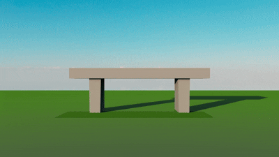

ICS 369 at UH Mānoa covers computational media systems, when I took the class we used Maya. Though there are several built-in functions to generate objects we coded our own functions to create and govern various types of objects, or particles. Different functions were added throughout the semester and the final project consisted of a showcase of all of them.

For my final project I created a scene in which balls bounce back and forth, rain and snow fall, and a sparkler is lit. Maya has many features and I enjoyed creating new textures, shaders, and animations. The following is an example of the settings I used for my final showcase:
```
emitters.append( Emitter( startFrame=1, endFrame=220, numParticlesPerFrame=1, 
                    minLifespan=48, maxLifespan=48,
                    minPos=(-18.0, 3.0, 6.0), maxPos=(-15.0, 12.0, 11.0), 
                    minVel=(1.70, -0.9, -0.10), maxVel=(1.90, 2.0, 0.10),
                    minElasticity=0.9, maxElasticity=0.95, 
                    minFriction=0.1, maxFriction=0.2,
                    startScale=(1.90,1.90,1.90), endScale=(3.0,3.0,3.0),
                    startColor=(0.30,0.30,0.30), endColor=(0.80,0.80,0.80),
                    startTransparency=0.0, endTransparency=0.0,
                    endSpecularity=0.8, startSpecularity=0.8,
                    startRotation=(0.0,0.0,0.0), endRotation=(0.0,0.0,0.0),
                    matte=False, emissive=False, name="Flying Ball Emitter-Left",
                    collisionFX=False, deathFX=False, singleParticle=False, trail=False,
                    circleGen=False, circleGenRadius=1.25, circleGenOrigin=(2.5, 0.0),
                    shape="sphere", dieOnCollision=False, interval=15, forceAdj=0.2,
                    customInterval=[10, 20, 28, 34, 40, 44, 47, 50, 52, 53, 55, 56, 57, 
                                    58, 59, 60, 62, 64, 67, 70, 195, 205, 210, 220],
                    randomSize=True, randomColor=True
                    )
                 )
```
